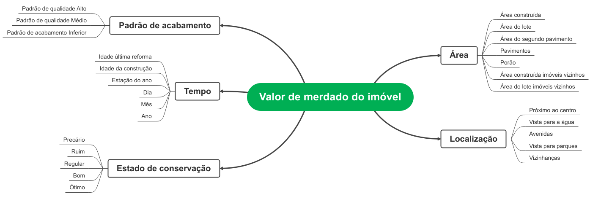
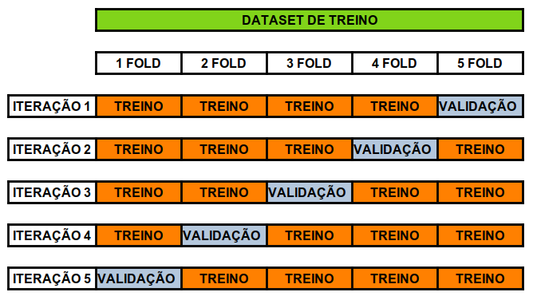

# Projeto Avaliação de imóveis no Condado King, Washington, USA.

## O projeto ( ⚠️ em andamento - conclusão parcial finalizada ⚠️ )

Este projeto fictício que compõe o meu portfólio profissional busca criar uma solução de negocio que auxiliará o governo do condado King, localizado no estado de Washington, USA a tomar melhores decisões relativas ao processo de desapropriação de imóveis que possam serem diretamente impactados por novos projetos de infraestrutura governamentais.

O projeto está estruturado nos seguintes passos:

    1. Questão de negocio
    2. Premissas do projeto
    3. Planejamento da solução e os produtos propostos
    4. Insights obtidos com os dados - modelo de machine learning
    5. Análise e resultados obtidos - modelo de machine learning
    6. Insights obtidos com os dados - Dashboard
    7. Análise e resultados obtidos - Dashboard
    8. Conclusão do projeto de portfólio
    9. Próximos passos para melhorar os produtos

## 1 Questão de negócio

O governo do Condado King está interessado em realizar obras de infraestrutura ao longo do seu território, porém não sabe ao certo quais projetos são melhores para as suas cidades. Dentro desse cenário, há diversos tipos de projetos que podem ser executados desde novas ruas, avenidas, parques até complexas intervenções viárias tais como hubs logisticos, monotrilhos, rodovias, trens etc.

Novas obras nas cidades alteram os espaços e consequentemente geram desapropriações de imoveis privados. Qualquer desapropriações é passível de justa indenização conforme o valor de mercado do bem. Sendo assim, qualquer obra tem o seu custo natural de execução, bem como é necessário indenizar todos aqueles que foram desapropriados. A questão do montante dos valores de indenização dos imóveis privados pode inviabilizar a execução de um determinado projeto.

### 1.1 Qual o problema de negócio?

Atualmente, o processo de avaliar o valor de mercado dos imóveis a serem desapropriados de um projeto municipal ocorre através da contratação de uma empresa de consultoria especializada. Sendo assim, esse serviço técnico consiste em uma despesa recorrente toda vez em que se deseja analisar a viabilidade de um projeto. Muitos desses projetos são inviáveis devido ao alto custo envolvido nos processos de desapropriações dos imóveis impactados. Entretanto, o condado e as prefeituras só têm essa real ideia desse impacto somente após a entrega dos laudos e relatorios técnicos da empresa de consultoria. Diante desse panorama, verificou-se que há muitas despesas com a contratação desse serviço e a tomada de decisão sobre a viabilidade geralmente ocorre depois de muito tempo.

Outra questão relevante surgiu após as últimas eleições dos novos prefeitos. O mercado imobiliario local está com novas expectativas com relação a execução de novos projetos no condado. Sendo assim, naturalmente inicia-se um processo de especulação imobiliaria, principalmente envolvendo as áreas no entorno desses possíveis projetos. Nesse novo cenário o condado e as prefeituras também devem ter o cuidado para não avaliar os imóveis passíveis de desapropriação acima do verdadeiro valor de mercado.

### 1.2 Proposta de solução do problema

A prefeitura quer desenvolver uma ferramenta capaz de estimar qual o valor das indenizações de imóveis privados que podem ser diretamente impactados por um projeto municipal. Com essa ferramenta a própria equipe técnica municipal será capaz de estimar os custos relativos as essas indenizações sem a contratação da empresa de consultoria. Além disso, os servidores públicos precisam ter o sentimento se os imóveis ofertados no mercado imobiliário local estão com preços muito acima do real valor de mercado. Ressalta-se que após a tomada de decisão de executar o projeto é necessário negociar com todos proprietários dos imóveis o valor da justa indenização. Somente depois que os mesmos podem ser desapropriados e demolidos. A melhor situação para a prefeitura é fechar os acordos amigavelmente sem a necessidade de acionar o poder judiciário. Quanto mais rápido os acordos são celebrados com proprietários mais rápido os imóveis a serem desapropriados podem ser demolidos.

Com base na solução do problema há dois objetivos específicos a serem alcançados:

1. Criar uma ferramenta capaz de avaliar o valor de mercado de um imóvel localizado dentro do município. O valor de mercado do imóvel avaliado deve ser justo de acordo com as suas características.

2. Avaliar no ano de 2022 se os preços ofertados dos imoveis nas imobiliárias da cidade estão de acordo com real o valor de mercado tendo em vista as características construtivas.

## 2 Premissas do projeto

Esse projeto de portfólio foi elaborado utilizado o dataset kc_house_data.csv existente na plataforma do Kaggle Inc. Ressalta-se que esse dataset possui 21613 imóveis localizados no condado King County no estado de Washington, US que foram vendidos no período de maio de 2014 a maio de 2015. Portanto, assumimos que os preços desses imóveis no dataset refletem as condições de mercado desse período.

Para construir a solução do segundo objetivo especifico desse projeto utilizaremos a técnica de webscrapy no site xxxx. Nesse processo tentaremos coletar as mesmas 20 variáveis existentes no dataset KC House e assim descartaremos todas as outras variáveis existentes no site xxx que podem ou não ser relevantes na composição do valor de mercado do imóvel. Os preços ofertados no site da imobiliária refletem as condições de mercado na data do webscrapy que ocorreu no ano de 2022.

Acrescenta-se que no processo de solução do segundo objetivo especifico de negocio o modelo calculará o valor predito dos imoveis coletados no site relativos as condições de mercado de 2014 a 2015. Para a aproximação dos resultados atualizaremos esses valores preditos para o ano de 2022 e compararemos com o valor ofertado em 2022.

Ressalta-se que esse hipotético projeto de portfólio foi elaborado segundo a experiencia do autor e com base nos dados coletados no kaggle e no site xxxx . Não sendo possível atestar sobre a veracidade dos dados do dataset e se os mesmos possuem conexão com o mercado de imóveis de King County no período de 2014 a 2015. Convém mencionar que no site xxxx há muitas outras variaveis que também contribuem na composição e explicação do valor de mercado do imóvel. A atualização dos valores preditos levou em consideração apenas os índices econômicos xxxx. Ressalta-se que não foram analisados outros aspectos que podem influenciar a variação do valor de mercado dentro do periodo de 2015 a 2022.

## 3 Planejamento da solução

### 3.1 Produtos propostos

Será entregue um modelo de machine learning capaz de estimar o valor de mercado de um imóvel. O modelo será colocado em produção em ambiente em nuvem e receberá como entrada uma planilha no formato .csv com todas as características do imóvel objeto de avaliação.

Será entregue um dashboard publicado no streamlite com a análise se os preços ofertados dos imoveis nas imobiliárias da cidade estão de acordo com real o valor de mercado dos mesmos.

### 3.2 Ferramentas utilizadas

* Python Packages
* Jupyter notebook
* Cloud Heroku
* Cloud Heroku
* streamlite
* Site xxxx

<table>
  <tbody>
    <tr valign="top">
      <td width="25%" align="center">
        Python  
        
      </td>
      <td width="25%" align="center">
        pandas  
        
      </td>
      <td width="25%" align="center">
        NumPy  
        
      </td>
      <td width="25%" align="center">
        SciPy  
        
      </td>
    </tr>
    <tr valign="top">
      <td width="25%" align="center">
        Matplotlib  
        
      </td>
      <td width="25%" align="center">
        seaborn  
        
      </td>
      <td width="25%" align="center">
        scikit-learn  
        
      </td>
      <td width="25%" align="center">
        XGBoost  
        
      </td>
    <tr valign="top">
    </tr>
    <tr valign="top">
    <td width="25%" align="center">
        Flask  
        
      </td>
      <td width="25%" align="center">
        Jupyter  
        
      </td>
      <td width="25%" align="center">
        Heroku  
        
      </td>
      <td width="25%" align="center">
        Streamlit  
        
      </td>
    </tr>
  </tbody>
</table>

### 3.3 Processo

***O modelo de machine learning***

Ao todo a execução da solução do projeto será dividida em 10 passos:

    1. Coleta e Descrição dos dados
    2. Feature engineering
    3. Filtragem dos dados
    4. Análise exploratória dos dados
    5. Preparação dos dados
    6. Seleção de variáveis
    7. Machine Learning Modeling
    8. Fine tunining
    9. Tradução do erro
    10. Deploy do modelo

***Dashboard***

A construção do dashboard será dividido em 7 passos:

  1. Realizar a coleta de informação de imoveis disponíveis na região do condado de King County Washington USA. Será realizado um webscrapy no site xxxx.
  2. Armazenar esses dados coletados em um arquivo .csv
  3. Calcular o valor de mercado dos imóveis coletados com o modelo de machine learnig
  4. Atualizar o valor calculado para o ano de 2022.
  5. Realizar a análise sobre a situação de mercado no condado.
  6. Construir o dasboard no streamlit
  7. Publicar o dashboard em ambiente de nuvem.

Criar hipoteses
		Afirmação
		comparação
		Valor base

Qual a diferença media entre os valores de mercado e os valores ofertados em toda cidade?

Em quais zipcodes a diferença no valor de mercado e o valor ofertado foi superior a 30 %?

Imóvel mais antigos possuem diferenças entre os valores de mercado e os ofertados superiores a 30%?

Imóvel mais novos possuem diferenças entre os valores de mercado e os ofertados superiores a 30%?

Metricas ano a ano / mês a mês - curva acumulada mês a mês

## 4 Insights obtidos com os dados - modelo de machine learning

Um dos objetivos da Análise Exploratória de Dados ( EDA ) é perceber qual o impacto das variáveis no fenômeno de interesse. Além disso, também é importante perceber quais variáveis podem ser relevantes para o modelo de machine learning. Durante a etapa de EDA desse projeto observou-se alguns insights interessantes durante a análise das hipóteses.

***Abaixo mostramos o mapa mental de hipóteses:***

  

***Hipótese 9: Imóveis localizados de frente para a água possuem preços maiores.***

  

  

A Hipótese mostrou ser verdadeira e assim imóveis localizados de frente para água possuem maiores preços de venda. Convém mencionar que o número de imóveis no dataset com essas caracteísticas corresponde a 0,75 %

***Hipótese 10: Imóveis localizados em avenidas possuem preços maiores.***

  

  

Observou-se que a hipótese é falsa e com base no análise dos dados foi possível verificar que o fato do imóvel estar localizado em uma avenida não interfere no seu valor nem para mais e nem para menos.

***Hipótese 13: Imóveis localizados em Seattle são os mais valorizados.***

  

  

A hipótese mostrou ser falsa e os imóveis localizados nas cidades Medina, Mercer Island, Bellevue entre outras possuem maiores preços médios e medianos de venda.

***Hipótese 15: Imóveis com padrão de acabamento médio ( grade 4-10) possuem maiores preços  por metro quadrado.***

  

  

Constatou-se que a hipótese é falsa e conforme previsto imóveis com alto padrão de acabamento possuem os maiores preços médios de venda por metro quadrado. Além disso, foi observado que os imóveis com padrão de acabamento inferior também possuem maiores preços médios e medianos por metro quadrado. Convém mencionar que existem apenas 4 imóveis de padrão de acabamento baixo e aproximadamente 500 de alto padrão.

***Hipótese 17: Imóveis reformados nos últimos 3 anos possuem preços maiores.***

  

Após a análise a hipótese mostrou ser falsa e imóveis reformados nos últimos 3 anos não possuem maiores preços médios e medianos.

***Hipótese 19: Imóveis com idade de construção superior a 50 anos possuem preços menores.***

  

preço médio x ano de construção

  

preço mediano x ano de construção

A hipótese é falsa. A análise apresentou algumas informações que requerem uma investigação maior. Observou-se que os menores valores encontrados foram para os imóveis construídos nos períodos de 1942 a 1944 e 1931 a 1934. Nesses períodos ocorreram fatos de grande relevância mundial, respectivamente segunda grande guerra e crise econômica da bolsa americana. Entretanto, para os imóveis construídos antes de 1931 e os construídos nos períodos de 1936 a 1941 apresentam preços de vendas no mesmo nível dos imóveis com menos de 50 anos de idade.

***Hipótese 20: Imóveis com idade de construção superior a 50 anos possuem preços / pé quadrado menores.***

  

Média preço/sqft2 x ano de construção

  

Mediana preço/sqft2 x ano de construção

Observou-se que essa hipótese é falsa e imóveis mais antigos possuem maiores preços médios e medianos por pé quadrado.

## 5 Análise e resultados obtidos - modelo de machine learning

### 5.1 Análise e resultados obtidos com o modelo

Neste projeto foram utilizados cinco diferentes modelos de machine learning para prever as vendas das lojas com base nos seus respectivos históricos.

* Modelo de média
* Modelo de Regressão linear
* Modelo de Regressão linear regularizada - Lasso
* Random Forest Regressor
* Xgboost Regressor

Abaixo destacamos as performances desses modelos antes de realizar o Cross Validation:

  

As métricas utilizadas para avaliar a performances dos modelos foram:

* MAE  - Mean Absolut Error (Erro absoluto médio)
* MAPE - Mean Absolut Percentage Error (Erro absoluto médio percentual)
* RMSE - Root Mean Squared Error (Raiz do erro quadrático médio )

O processo de validação cruzada do nosso problema de negócio dividiu o dataset de treino em 5 folds.

  

Os modelos alcançaram as seguintes performances após o cross validation:

  

O critério para analisar a performance geral dos modelos após o crosss validation foi calcular a médias e os desvios padrão dos resultados obtidos nos 5 folds.

O modelo Random Forest Regressor apresentou a melhor performance entre os modelos nesse primeiro ciclo do CRISP-DM. Observa-se que a dispersão entorno dos valores médios dos erros são menores. Convém mencionar o modelo XGBoost teve um performance muito próxima o que também o torna um bom candidato a ser escolhido no primeiro ciclo do CRIPS-DM, tendo em vista que Random Forest Regressor exige mais tempo de treinamento e requer mais recursos computacionais e de armazenamento para o modelo treinado. Diante disso, o modelo XGBoost foi o modelo selecionado para realizar as previsões de negócio nesse primeiro ciclo.

### 5.2 Performance após Fine Tuning dos hiperparâmetros
O método utilizado para a realizar a otimização dos hiperparâmetros do modelo foi o random search. Os parâmetros utilizados foram:
* eta
* max_depth
* min_child_weight
* subsample
* colsample_bytree
* n_estimators

A performance após o Fine Tuning Hyperparameters apresentou os seguintes valores:

  

### 5.3 Business Performance

Um importante papel que o cientista de dados deve exercer é traduzir a performance obtida na modelagem de machine learning em resultados de negócios. A métrica MAE foi a balizadora para a construção dos melhores e piores cenários da performance de negócio de cada imóvel. Abaixo encontra-se a performances de cinco imóveis existentes no conjunto de teste.

  

Ressalta-se que entorno do valor predito de cada imóvel há um range mostrando a influencia do erro MAE do modelo na previsão.

Observações referente ao imóvel com index 735 do dataset de teste:

* A previsão do valor de mercado do imóvel corresponde a $380.523,59

* O erro absoluto médio (MAE) do modelo é equivalente a $65.408,17

* O limite inferior para a previsão consiste na previsão ***menos***  MAE, o que corresponde ao valor de venda de $315.115,42

* O limite superior para a previsão consiste no valor da previsão ***mais*** o MAE do modelo, o que totaliza $445.931,17

* Constata-se que o preço no qual o imóvel foi comercializado corresponde a $365.000,00, o que está dentro do intervalo do range do modelo.  

* O erro absoluto médio percentual (MAPE) do modelo é 12%, em média o modelo erra 12% entorno da média.

### 5.4 Machine Learning Performance

O erro médio percentual do modelo corresponde a -1,52% o que indica que o modelo tende a superestimar os valores preditos. A seguir mostramos o gráfico de dispersão do erro com relação aos valores preditos.

  

O Histograma da distribuição do erro apresentou o seguinte comportamento:

  

Observando a evolução das predições com o decorrer do tempo constata-se que as previsões de modo geral seguem o padrão de comportamento dos preços de venda dos imóveis.

  

A evolução do erro e da taxa de erro com o decorrer do tempo apresentaram os seguintes comportamentos:

  

Evolução do erro

  

Taxa de erro

### 5.5 Deploy do modelo

O deploy do modelo foi publicado no heroku cloud e a API foi construída usando o pacote Flask do python. Abaixo temos um diagrama da arquitetura da solução implementada:

  

Após o deploy no Heroku qualquer dispositivo/usuário será capaz de obter as previsões dos imóveis via API.

## 6 Conclusão do projeto de portfólio (Conclusão parcial)

### 6.1 Produto - modelo de machine learning
Após o desenvolvimento do produto "modelo de machine learning" nesse primeiro ciclo (CRISP-DM), observou-se que o produto proposto como solução do problema de negócio do governo do condado King conseguiu alcançar o objetivo desejado. O modelo de machine learning mostrou-se capaz de prever os valores de vendas dos imóveis existentes no dataset de teste. Ressalta-se que com esse produto de dados, os servidores da administração pública do condado King conseguirão estimar os valores de mercado dos imóveis passíveis de desapropriação sem a necessidade da contratação da empresa de consultoria para avaliar os imóveis. Dessa forma, a nova ferramenta desenvolvida auxiliará o governo do condado e dos municípios a tomarem decisões estratégicas sobre a viabilidade de novos projetos de infraestrutura de forma mais rápida e com um menor custo para os cofres públicos.

## 7 Próximos passos para melhorar os produtos

### 7.1 Produto Modelo de machine Learning

Após a primeira entrega é possível seguir por vários caminhos distintos nos próximos ciclos do CRISP-DM. Geralmente essa decisão poderá ser pautada por novas demandas vinda do governo do condado King e de seus servidores ou em função da motivação da equipe de ciencia de dados.

Destacamos as seguintes possibilidades de caminhos:

* Pesquisar novas variáveis macroeconômicas que podem ser utilizadas para treinar o modelo.

* Melhorar a performance do modelo XGBoost através de um nova análise exploratória de dados, focando os imóveis que obtivem valores maiores de MAPE.

* Construir novas hipóteses de negócios com objetivos de entender o comportamento de mercado.

* Realizar Hyperparameter Fine Tuning no modelo Random Forest Regressor, pois apresentou performance um pouco superior ao XGBoost.

* Realizar uma nova análise exploratória de dados com o objetivo de entender quais variáveis comprometeram de forma significativa as performances dos modelos de regressão linear e regressão lasso.

* Testar outros modelos de machine learning com objetivo de melhorar a performance.

### Autor

Deivison Morais. Visite o meu portfólio de projetos [aqui.](https://deivison1983.github.io/portfolio_projetos/)

### Contatos

  
  

