# Property Valuation Project in King County, Washington, USA.

# 
🇧🇷 [Versão em Português](https://github.com/deivison1983/king_county_real_estate_valuation)

## Project ( ⚠️ em andamento - conclusão parcial finalizada ⚠️ )

This fictitious project that composes my professional portfolio seeks to create a business solution that will help the government of King County, located in the state of Washington, USA to make better decisions regarding the process of expropriation of properties that can be directly impacted by new projects of government infrastructure.

The project is structured in the following steps:

   1. Business question
   2. Project Assumptions
   3. Solution planning and proposed products
   4. Data Insights - machine learning model (Finished)
   5. Analysis and results obtained - machine learning model (Finished)
   6. Insights from the data - Dashboard
   7. Analysis and results obtained - Dashboard
   8. Conclusion of the portfolio project
   9. Next steps to improve products

## 1 Business question

The King County government is interested in carrying out infrastructure works throughout its territory, but is not sure which projects are best for its cities. Within this scenario, there are several types of projects that can be executed from new streets, avenues, parks to complex road interventions such as logistical hubs, monorails, highways, trains, etc.

New works in cities alter spaces and consequently generate expropriations of private properties. Any expropriation is subject to fair compensation according to the market value of the asset. Therefore, any work has its natural cost of execution, as well as it is necessary to indemnify all those who were expropriated. The question of the amount of indemnification values of private properties can make the execution of a given project unfeasible.

### 1.1 What is the business problem?

Currently, the process of evaluating the market value of properties to be expropriated from a municipal project occurs through the hiring of a specialized consulting company. Therefore, this technical service is a recurring expense every time you want to analyze the feasibility of a project. Many of these projects are unfeasible due to the high cost involved in the expropriation processes of the impacted properties. However, the county and the prefectures only have this real idea of this impact only after the delivery of reports and technical reports from the consulting company. Given this scenario, it was found that there are many expenses with hiring this service and the decision-making on the feasibility usually takes place after a long time.

Another relevant issue arose after the last elections of the new mayors. The local real estate market has new expectations regarding the execution of new projects in the county. Therefore, a process of real estate speculation naturally begins, mainly involving the areas surrounding these possible projects. In this new scenario, the county and municipal governments must also be careful not to evaluate properties subject to expropriation above the true market value.

### 1.2 Proposed solution to the problem

The city government wants to develop a tool capable of estimating the value of compensation for private properties that can be directly impacted by a municipal project. With this tool, the municipal technical team itself will be able to estimate the costs related to these indemnities without hiring the consulting company. In addition, public servants need to feel if the properties offered in the local real estate market are priced well above the real market value. It should be noted that after making the decision to execute the project, it is necessary to negotiate with all property owners the value of fair compensation. Only after that they can be expropriated and demolished. The best situation for the prefecture is to close the agreements amicably without the need to trigger the judiciary. The faster agreements are concluded with landlords, the faster properties to be expropriated can be demolished.

Based on the solution of the problem, there are two specific objectives to be achieved:

1. Create a tool capable of evaluating the market value of a property located within the municipality. The market value of the appraised property must be fair according to its characteristics.

2. Evaluate in the year 2022 if the prices offered by the real estate agencies in the city are in accordance with the real market value in view of the constructive characteristics.

## 2 Project assumptions

This portfolio project was created using the kc_house_data.csv dataset existing on the Kaggle Inc platform. It should be noted that this dataset has 21613 properties located in King County in the state of Washington, US that were sold in the period from May 2014 to May 2015. Therefore, we assume that the prices of these properties in the dataset reflect the market conditions of this dataset period.

To build the solution for the second specific objective of this project, we will use the webscrapy technique on the site xxxx. In this process, we will try to collect the same 20 variables existing in the KC House dataset and thus we will discard all the other variables existing in the xxx site that may or may not be relevant in the composition of the market value of the property. The prices offered on the real estate website reflect market conditions on the date of the webscrapy that took place in 2022.

It is added that in the process of solving the second specific business objective, the model will calculate the predicted value of the properties collected on the website related to market conditions from 2014 to 2015. To approximate the results, we will update these predicted values for the year 2022 and we will compare with the value offered in 2022.

It is noteworthy that this hypothetical portfolio project was elaborated according to the author's experience and based on data collected on kaggle and on the website xxxx . It is not possible to attest to the veracity of the dataset data and whether they have a connection with the King County real estate market in the period from 2014 to 2015. It is worth mentioning that on the website xxxx there are many other variables that also contribute to the composition and explanation of the market value of the property. The update of the predicted values only took into account the xxxx economic indices. It should be noted that other aspects that may influence the variation in market value within the period from 2015 to 2022 were not analyzed.

## 3 Solution planning

### 3.1 Proposed products

A machine learning model capable of estimating the market value of a property will be delivered. The model will be put into production in a cloud environment and will receive as input a spreadsheet in .csv format with all the characteristics of the property being evaluated.

A dashboard published on streamlite will be delivered with the analysis if the prices offered by the real estate agencies in the city are in accordance with their real market value.

### 3.2 Tools used in this project

* Python Packages
* Jupyter notebook
* Cloud Heroku
* Streamlit
* Site xxxx

<table>
  <tbody>
    <tr valign="top">
      <td width="25%" align="center">
        Python  
        
      </td>
      <td width="25%" align="center">
        pandas  
        
      </td>
      <td width="25%" align="center">
        NumPy  
        
      </td>
      <td width="25%" align="center">
        SciPy  
        
      </td>
    </tr>
    <tr valign="top">
      <td width="25%" align="center">
        Matplotlib  
        
      </td>
      <td width="25%" align="center">
        seaborn  
        
      </td>
      <td width="25%" align="center">
        scikit-learn  
        
      </td>
      <td width="25%" align="center">
        XGBoost  
        
      </td>
    <tr valign="top">
    </tr>
    <tr valign="top">
    <td width="25%" align="center">
        Flask  
        
      </td>
      <td width="25%" align="center">
        Jupyter  
        
      </td>
      <td width="25%" align="center">
        Heroku  
        
      </td>
      <td width="25%" align="center">
        Streamlit  
        
      </td>
    </tr>
  </tbody>
</table>

### 3.3 Process

***The machine learning model***

Ao todo a execução da solução do projeto será dividida em 10 passos:

Altogether, the execution of the project solution will be divided into 10 steps:

 1. Data Collection and Description
 2. Feature engineering
 3. Data filtering
 4. Exploratory data analysis
 5. Data preparation
 6. Selection of variables
 7. Machine Learning Modeling
 8. Fine tuning
 9. Results and interpretation of errors
 10. Model Deployment

***Dashboard***

The construction of the dashboard will be divided into 7 steps:

   1. Carry out the collection of information on properties available in the region of King County Washington USA. A webscrapy will be performed on the site xxxx.
   2. Store this collected data in a .csv file
   3. Calculate the market value of the properties collected with the machine learning model
   4. Update the calculated value for the year 2022.
   5. Conduct the analysis of the market situation in the county.
   6. Build the dasboard in streamlit
   7. Publish the dashboard to the cloud environment.

## 4 Data Insights  - machine learning model

One of the objectives of Exploratory Data Analysis (EDA) is to understand the impact of variables on the phenomenon of interest. In addition, it is also important to realize which variables might be relevant to the machine learning model. During the EDA stage of this project, some interesting insights were observed during the analysis of the hypotheses.

***Abaixo mostramos o mapa mental de hipóteses:***

 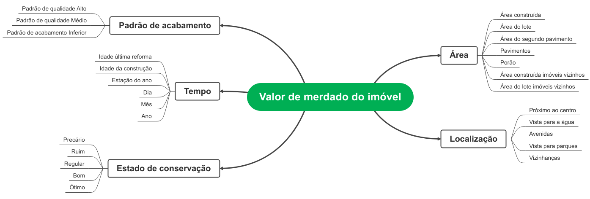 

***Hypothesis 9: Properties located facing the water have higher prices.***

 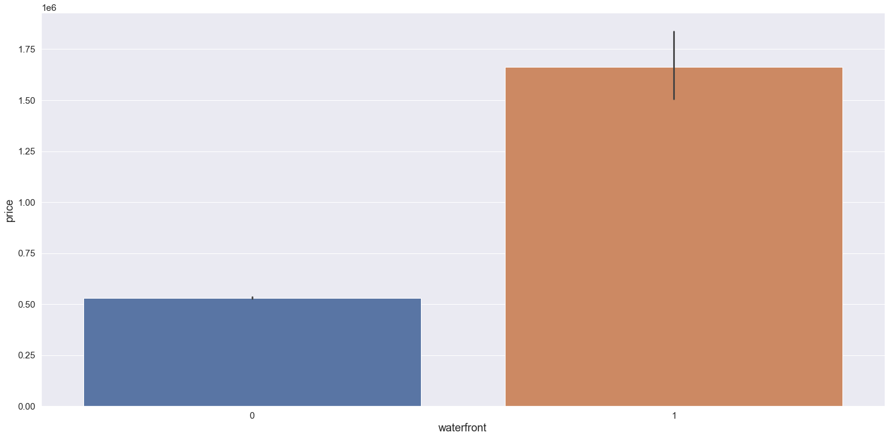 

 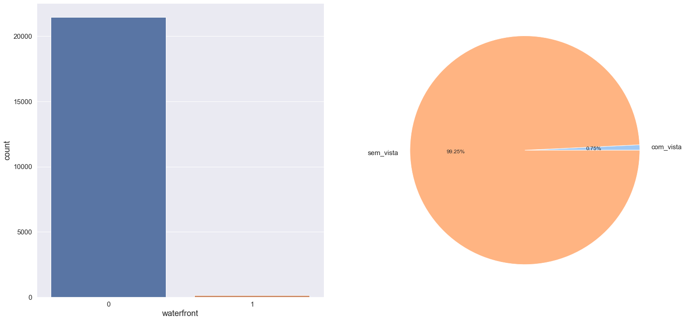 

The Hypothesis proved to be true and thus properties located facing the water have higher sales prices. It is worth mentioning that the number of properties in the dataset with these characteristics corresponds to 0.75%

***Hipótese 10: Imóveis localizados em avenidas possuem preços maiores.***

 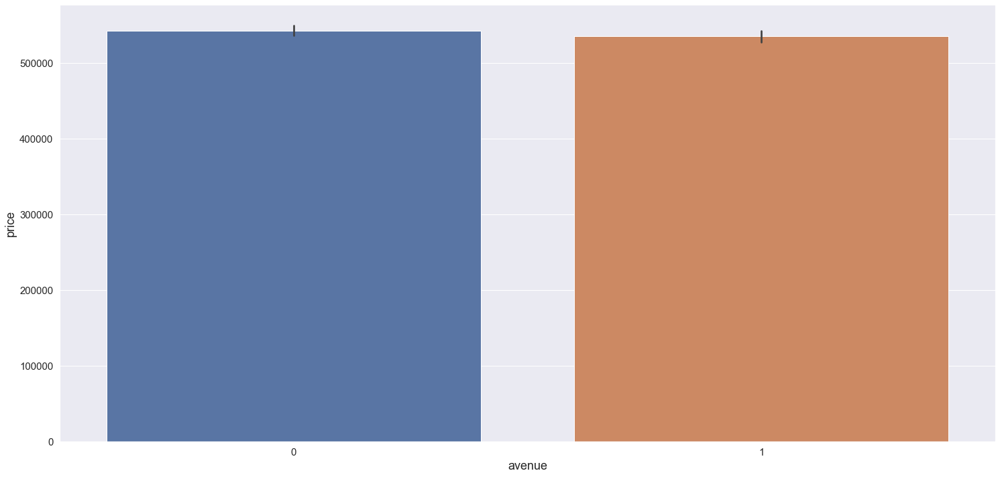 

 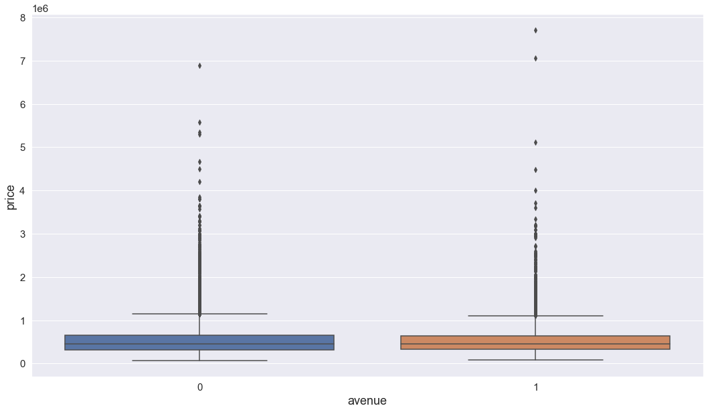 

It was observed that the hypothesis is false and based on the data analysis it was possible to verify that the fact that the property is located on an avenue does not interfere with its value either for more or for less.

***Hypothesis 13: Properties located in Seattle are the most valued.***

 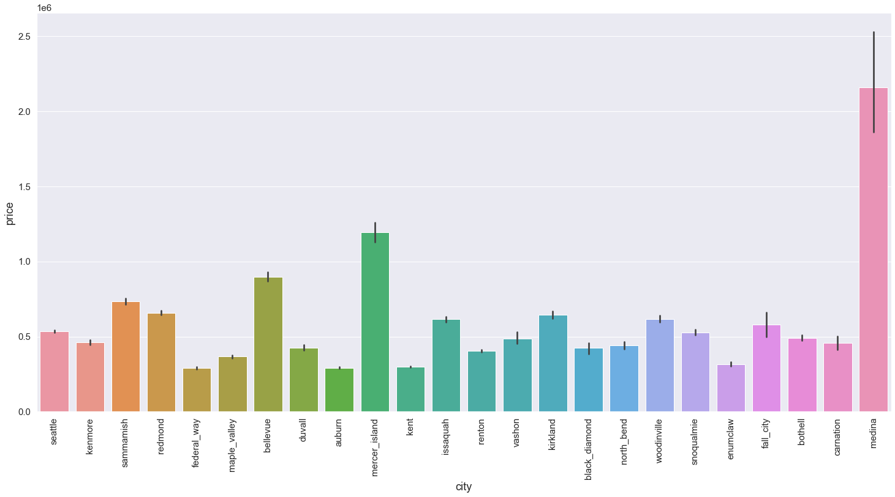 

 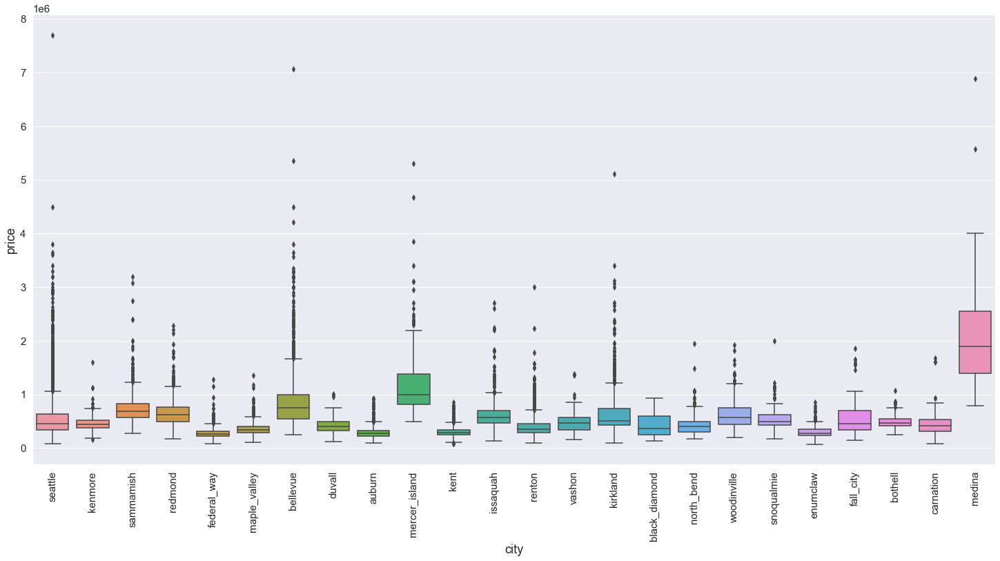 

The hypothesis proved to be false and properties located in the cities of Medina, Mercer Island, Bellevue, among others, have higher average and median sales prices.

***Hypothesis 15: Properties with a medium finish standard (grade 4-10) have higher prices per square meter.***

 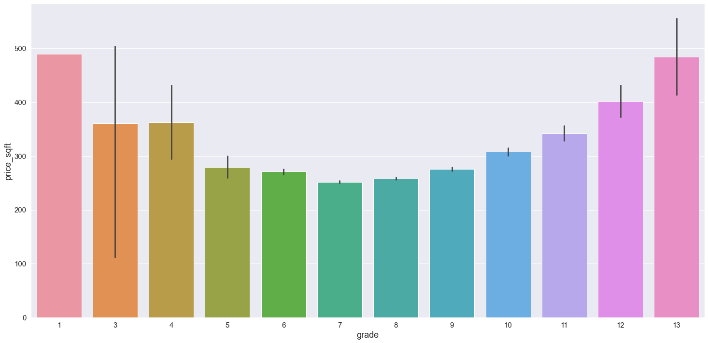 

 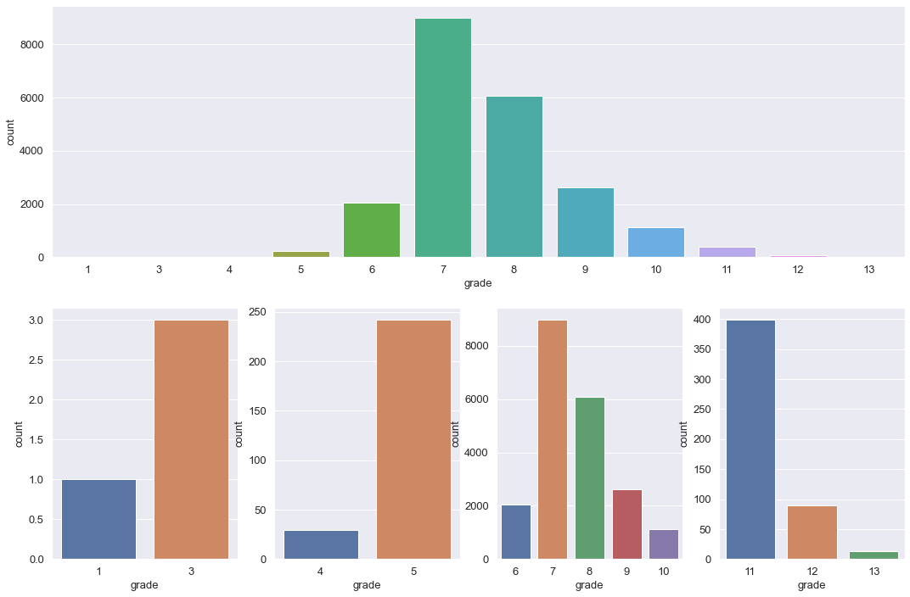 

It was found that the hypothesis is false and, as expected, properties with a high-end standard  have the highest average sales prices per square meter. In addition, it was observed that properties with a low-end property also have higher average and median prices per square meter. It should be mentioned that there are only 4 low-end properties and approximately 500 high-end properties.

***Hypothesis 17: Properties renovated in the last 3 years have higher prices.***

 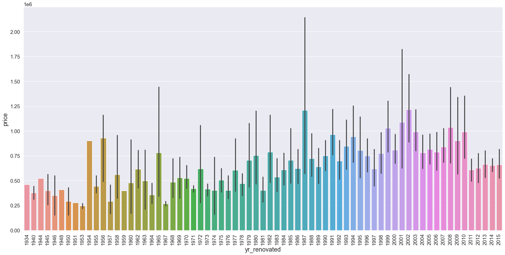 

After the analysis, the hypothesis proved to be false and properties renovated in the last 3 years do not have higher average and median prices.

***Hypothesis 19: Properties with a construction age over 50 years have lower prices.***

 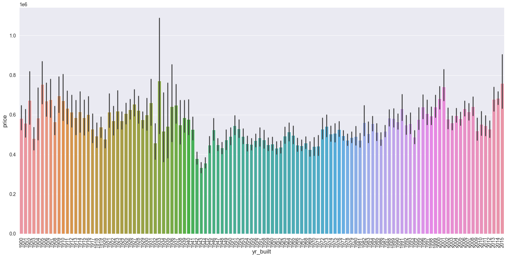 

average price x year of construction

 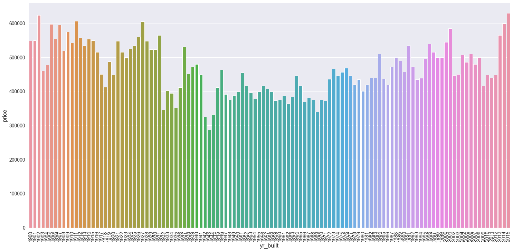 

median price x year of construction

The hypothesis is false. The analysis presented some information that requires further investigation. It was observed that the lowest values found were for properties built in the periods from 1942 to 1944 and 1931 to 1934. In these periods, events of great global relevance occurred, respectively the Second World War and the economic crisis of the American stock exchange. However, properties built before 1931 and those built between 1936 and 1941 have sales prices at the same level as properties under 50 years old..

***Hypothesis 20: Properties with a construction age of more than 50 years have lower prices/square foot.***

 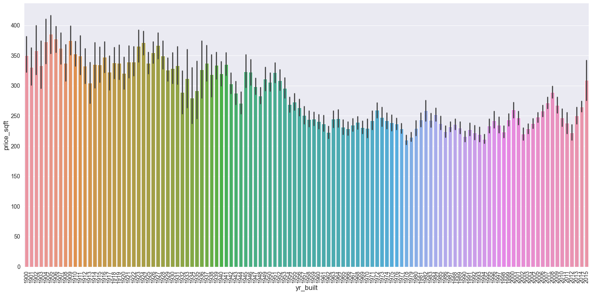 

Average price/sqft2 x year of construction

 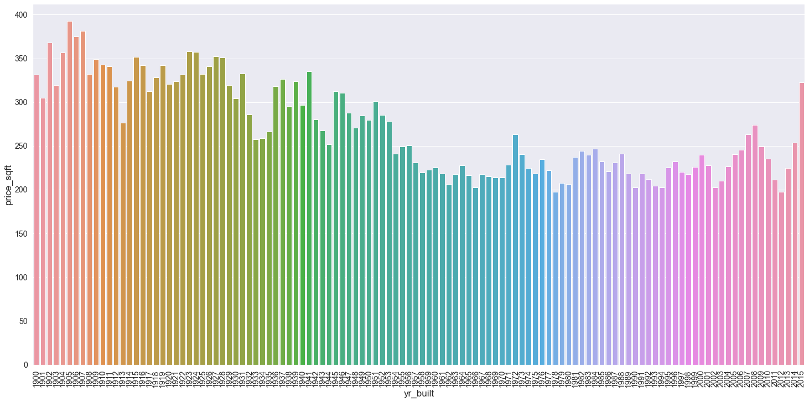 

Median price/sqft2 x year of construction

It was observed that this hypothesis is false and older properties have higher average and median prices per square foot.

## 5 Analysis and results obtained - machine learning model

### 5.1 Analysis and results obtained with the model

In this project, five different machine learning models were used to predict the sale values of properties based on their respective commercialization histories.

* Average model
* Linear Regression Model
* Linear Regression Regularized Model - Lasso
* Random Forest Regressor
* Xgboost Regressor

Below we highlight the performances of these models before performing the Cross Validation:

 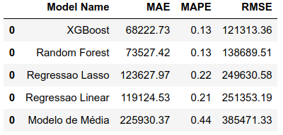 

The metrics used to evaluate the performance of the models were:

* MAE  - Mean Absolut Error
* MAPE - Mean Absolut Percentage Error
* RMSE - Root Mean Squared Error

The cross-validation process of our business problem split the training dataset into 5 folds.

 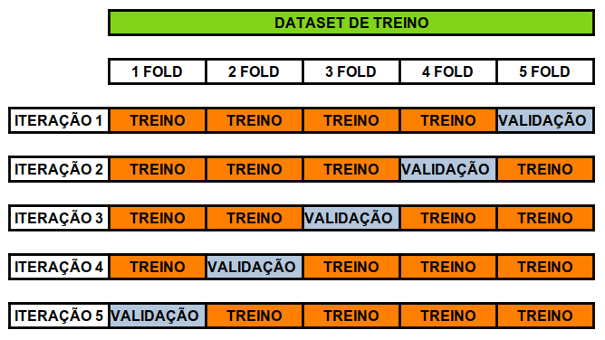 

The models achieved the following performances after cross validation:

 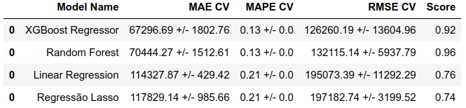 

The criterion to analyze the general performance of the models after crosss validation was to calculate the means and standard deviations of the results obtained in the 5 folds.

The Random Forest Regressor model presented the best performance among the models in this first CRISP-DM cycle. It is observed that the dispersion around the mean values of the errors are smaller. It is worth mentioning that the XGBoost model had a very close performance, which also makes it a good candidate to be chosen in the first CRIPS-DM cycle, given that Random Forest Regressor requires more training time and requires more computational and storage resources to the trained model. In view of this, the XGBoost model was the model selected to carry out business forecasts in this first cycle.

### 5.2 Performance after Fine Tuning of hyperparameters
The method used to perform the optimization of the model's hyperparameters was the random search. The parameters used were:
* eta
* max_depth
* min_child_weight
* subsample
* colsample_bytree
* n_estimators

The performance after Fine Tuning Hyperparameters showed the following values:

 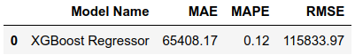 

### 5.3 Business Performance

An important role that the data scientist must play is to translate the performance obtained in machine learning modeling into business results. The MAE metric was the benchmark for the construction of the best and worst scenarios of the business performance of each property. Below is the performance of five properties in the test dataset.

 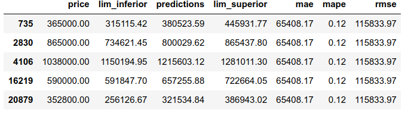 

It is noteworthy that around the predicted value of each property there is a range showing the influence of the MAE error of the model on the forecast.

Notes regarding the property with index number 735 of the test dataset:

* The estimated market value of the property corresponds to $380,523.59

* The mean absolute error (MAE) of the model is equivalent to $65,408.17

* The lower bound for the forecast consists of the forecast value ***minus*** the MAE, which corresponds to the sale value of $315,115.42

* The upper bound for the forecast consists of the forecast value ***plus*** the MAE of the model, which totals $445,931.17

* It appears that the price at which the property was sold corresponds to $365,000.00, which is within the range of the model.

* The mean percentage absolute error (MAPE) of the model is 12%, on average the model is off by 12% around the mean.

### 5.4 Machine Learning Performance

The average percentage error of the model corresponds to -1.52%, which indicates that the model tends to overestimate the predicted values. The following shows the scatterplot of the error with respect to the predicted values.

 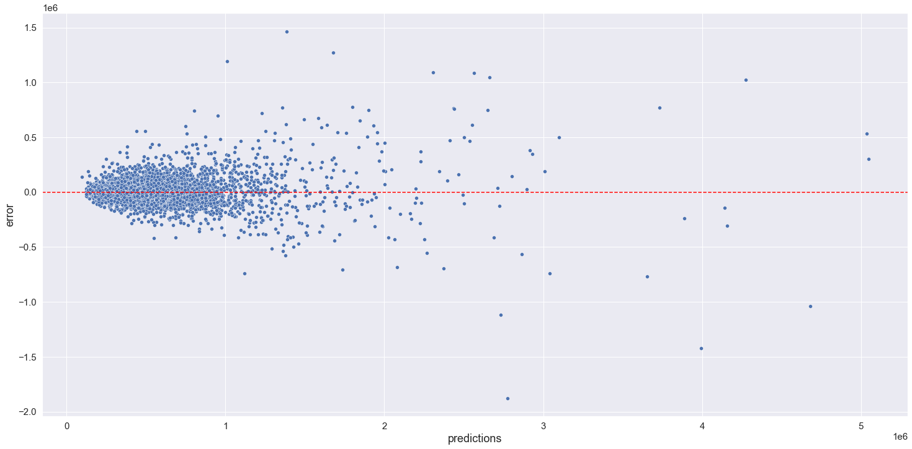 

The error distribution histogram showed the following behavior:

 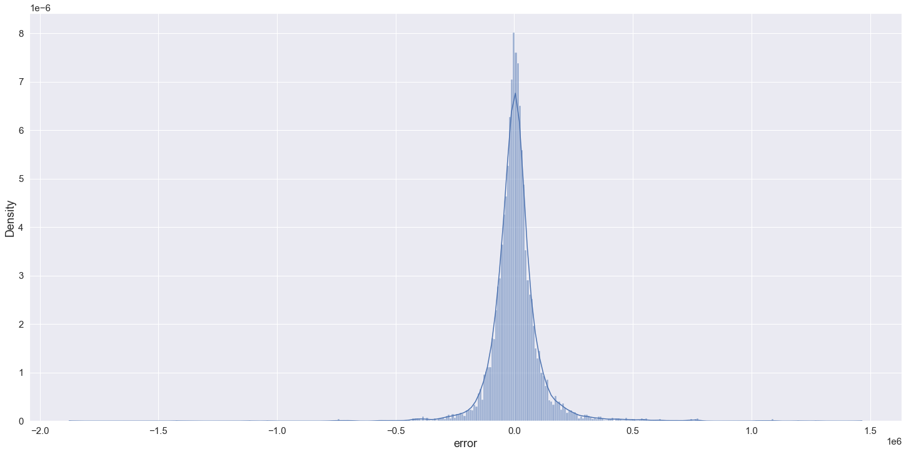 

Observing the evolution of the predictions over time, it appears that the predictions generally follow the pattern of behavior of real estate sales prices.

 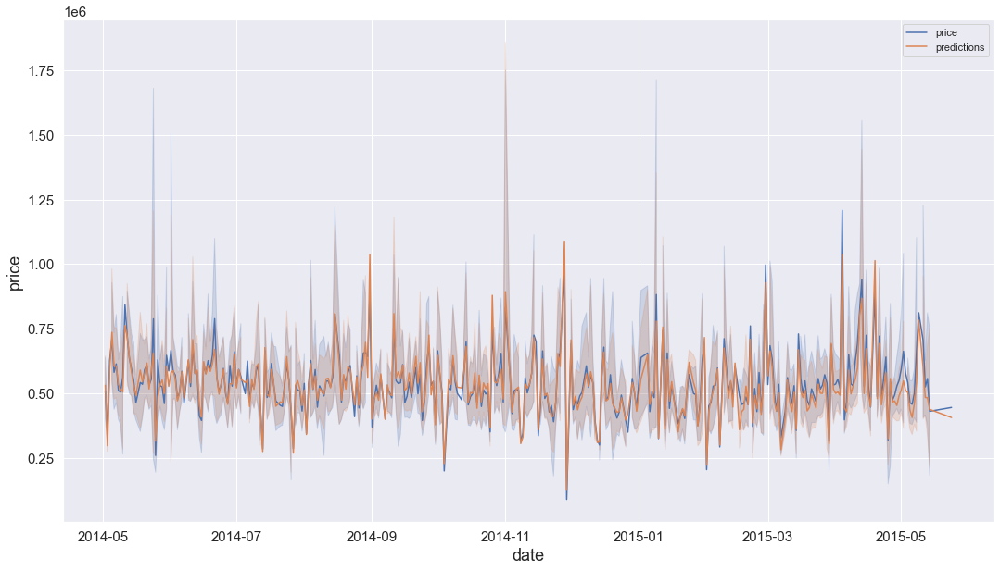 

The evolution of the error and the error rate over time showed the following behaviors:

 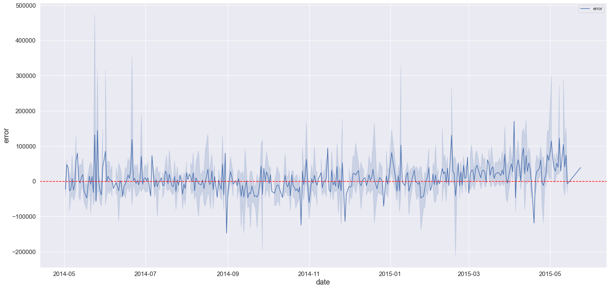 

Error evolution

 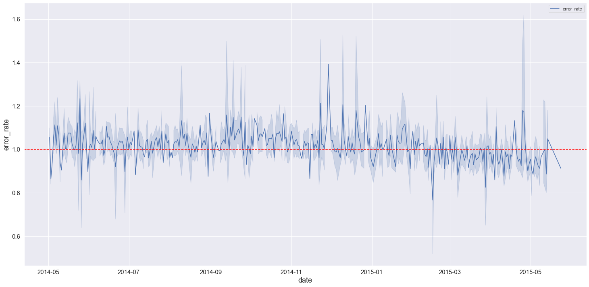 

Error rate

### 5.5 Deploy

Model deploy was published to heroku cloud and the API was built using python's Flask package. Below we have a diagram of the implemented solution architecture:

  

After deploying to Heroku any device/user will be able to get real estate forecasts via API.

## 6 Portfolio project Conclusion ( ⚠️ Partial Conclusion ⚠️)

### 6.1 Product - machine learning model
After the development of the product "machine learning model" in this first cycle (CRISP-DM), it was observed that the product proposed as a solution to the business problem of the King County government managed to achieve the desired objective. The machine learning model proved to be able to predict the sales values of properties in the test dataset. It is noteworthy that with this data product, King County Public Administration servers will be able to estimate the market values of properties subject to expropriation without the need to hire a consulting company to evaluate the properties. In this way, the new tool developed will help the county and municipal government to make strategic decisions about the feasibility of new infrastructure projects more quickly and at a lower cost to the public coffers.

## 7 Next steps to improve products

### 7.1 Product Machine Learning Model

After the first delivery, it is possible to follow several different paths in the next CRISP-DM cycles. Generally, this decision may be guided by new demands coming from the King County government and its servers or depending on the motivation of the data science team.

We highlight the following possibilities of paths:

* Search for new macroeconomic variables that can be used to train the model.

* Improve the performance of the XGBoost model through a new exploratory data analysis, focusing on properties with higher MAPE values.

* Build new business hypotheses in order to understand market behavior.

* Perform Hyperparameter Fine Tuning on the Random Forest Regressor model, as it presented a slightly higher performance than XGBoost.

* Conduct a new exploratory data analysis in order to understand which variables significantly compromised the performance of the linear regression and lasso regression models.

* Test other machine learning models to improve performance.

### Author

Deivison Morais. Visit my portfolio [here.](https://deivison1983.github.io/portfolio_projetos/)

### Contacts

  
  

